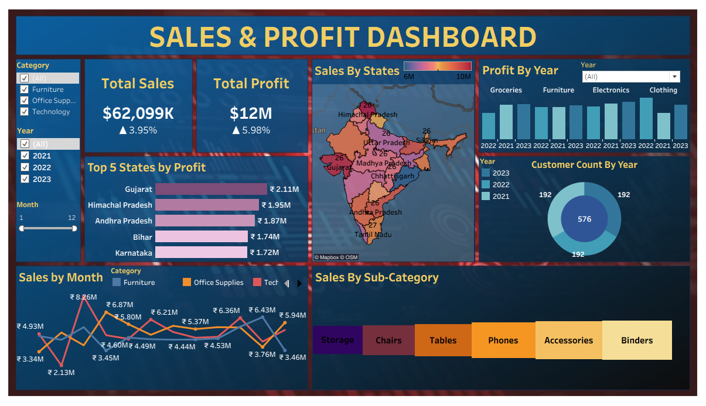

# Sales & Profit Dashboard (Tableau)

This project presents an interactive **Sales & Profit Dashboard** built using Tableau to analyze
sales performance, profit trends, and customer distribution across states, categories, and time.

The dashboard helps in identifying high-performing regions, profitable product categories,
and monthly sales patterns to support data-driven business decisions.

---

## 📊 Dashboard Preview

---

## 📌 Project Overview
- Analyzed sales and profit trends across multiple years
- Evaluated state-wise and category-wise performance
- Identified top-performing states by profit
- Visualized customer count distribution by year
- Enabled interactive filtering by year and category

---

## 🛠 Tools & Technologies
- Tableau
- CSV Dataset
- Data Analysis & Visualization

---

## 📁 Files in this Repository
- `Dashboard.twb`  
  Tableau workbook containing the complete interactive dashboard

- `updated_sales_data_with_states_cities.csv`  
  Cleaned sales dataset used for analysis

- `sales_profit_dashboard.png`  
  Dashboard preview image for quick viewing

---

## ▶ How to View the Dashboard
- Open the `.twb` file using **Tableau Desktop** or **Tableau Reader (free)**
- The dataset is included for reproducibility and reference

---

## 🎯 Key Skills Demonstrated
- Data Cleaning & Preparation
- Exploratory Data Analysis (EDA)
- Data Visualization & Dashboard Design
- Sales & Profit Analysis
- Business Insight Generation

---

## 📌 Purpose
This project is part of my data analytics portfolio and demonstrates my ability
to analyze data, design insightful dashboards, and communicate findings effectively.

---

## 👤 Author
**Shrushti Thakur**  
Master’s in Data Science (Pursuing)  
Aspiring Data Analyst
